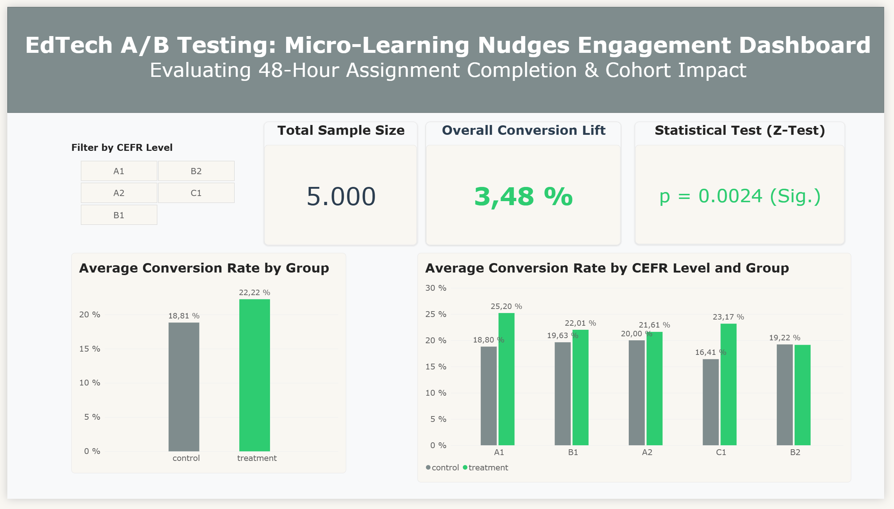

# EdTech A/B Testing: Optimizing Student Engagement via Micro-Learning Nudges

<p align="center">
  
</p>

## 1. The Problem

Online educational platforms face significant passive student drop-off on challenging coursework. Failing to engage students before key deadlines leads to lower assignment completion rates, diminished learning outcomes, and elevated long-term subscription churn. This drop-off directly impacts EdTech product managers striving for higher platform retention and instructional designers aiming to minimize learning friction.

## 2. Objective

The primary objective of this project is to evaluate whether replacing standard, generic deadline notifications with personalized, low-friction **micro-learning nudges** significantly improves assignment completion within 48 hours without introducing allocation bias or segment friction.

## 3. Methodology

### Data & Target

* **Source:** Simulated experimental dataset representing an online learning platform environment.
* **Volume:** 5,000 total student records split evenly between variants.
* **Features:** Student demographic features including language proficiency level (`cefr_level`: A1, A2, B1, B2, C1).
* **Target Metric:** `completed_assignment` (Binary: 1 = completed within 48 hours, 0 = abandoned).

### Experimental & Validation Strategy

* **Randomization & SRM Check:** Conducted a Chi-Square Goodness-of-Fit test ($p = 1.0000$) to verify a 50/50 allocation ratio and rule out Sample Ratio Mismatch (SRM) or allocation bias.
* **Hypothesis Testing:** Executed a Two-Sample Z-Test for Proportions and calculated 95% Wald confidence intervals to evaluate the global treatment impact against a significance threshold ($\alpha = 0.05$).
* **Segmented Cohort Analysis:** Granularized conversion metrics across student proficiency cohorts (A1 to C1) to assess behavioral heterogeneity across learner levels.
* **SQL Query Validation:** Ingested datasets into an in-memory `sqlite3` database to execute relational queries and validate core metric aggregations.

## 4. Findings

### Experimental Performance Summary

| Experimental Group | Sample Size ($N$) | Completed Assignments | Conversion Rate (%) | Absolute Lift | $p$-value |
| --- | --- | --- | --- | --- | --- |
| **Control Group** | 2,500 | 474 | 18.96% | Baseline | — |
| **Treatment Group** | 2,500 | 561 | **22.44%** | **+3.48%** | **0.0024** |

* **Global Statistical Significance:** The micro-learning nudge strategy achieved a statistically significant +3.48% absolute lift (+18.35% relative lift) in 48-hour assignment completion ($p = 0.0024$), with a 95% confidence interval of [1.24%, 5.72%].
* **Begging-Level Impact:** Beginners (A1 cohort) exhibited a significant +6.40% absolute conversion lift ($p = 0.0060$), proving that low-friction micro-learning prompts reduce initial cognitive overload and task paralysis.
* **Advanced-Level Impact:** Advanced students (C1 cohort) demonstrated a significant +6.76% absolute conversion lift ($p = 0.0227$), showing that clear, structured action triggers effectively address procrastination on complex modules.
* **Intermediate Friction:** Intermediate cohorts (A2, B1, B2) showed minor or non-statistically significant variations ($p > 0.05$), with B2 showing negligible change (-0.09%), confirming that a uniform, "one-size-fits-all" communication strategy is suboptimal.

## 5. Recommendations

* **Targeted Deployment:** Roll out the micro-learning nudge strategy immediately for A1 and C1 cohorts to maximize 48-hour completion rates and reduce early-stage drop-off.
* **Iterative Messaging for Intermediate Cohorts:** Redesign notification copy and timing specifically for A2–B2 students, exploring contextual triggers or adaptive difficulty mechanics rather than generic reminders.
* **BI & Pipeline Integration:** Utilize the exported Power BI dataset (`dataset/powerbi_ab_test_summary.csv`) to establish real-time dashboard monitoring for ongoing retention and cohort-level conversion tracking.

## 6. Technologies

* **Language:** Python 3.9
* **Data Manipulation & Database:** Pandas, NumPy, SQLite3
* **Statistical Analysis:** SciPy (`chisquare`), Statsmodels (`proportions_ztest`, `confint_proportions_2indep`)
* **Visualization:** Matplotlib, Seaborn

---

## Project Structure

```text
├── data/                  # Local directory for raw and exported CSV files
├── img/                   # Generated experimental charts and visualization figures
├── notebook/              # Jupyter Notebook containing A/B test analysis and SQL validation
├── README.md              # Executive summary and project documentation
└── requirements.txt       # Project dependencies

```

---

## Installation & Environment Setup

This project uses an isolated Python environment. To replicate this setup, run the following commands in your terminal:

### 1. Clone the repository

```bash
git clone https://github.com/fiorellatrigo/edtech-ab-testing-engagement.git
cd edtech-ab-testing-engagement

```

### 2. Create and activate the virtual environment

* **Windows:**

```powershell
python -m venv env
.\env\Scripts\activate

```

* **Mac/Linux:**

```bash
python -m venv env
source env/bin/activate

```

### 3. Install dependencies

```bash
pip install -r requirements.txt

```